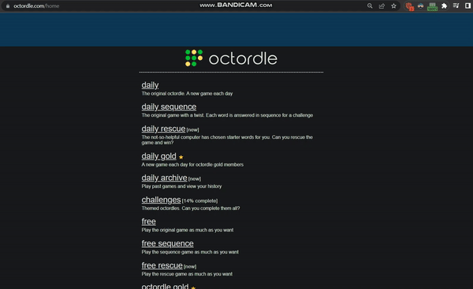

# Octordle Helper


This code repository is a fork of [Wordle helper](https://github.com/mysticuno/wordle-helper) that I adapted to assist with solving [Octordle](https://octordle.com/daily) puzzles.


## Demo
The extension will narrow down the possible words based on the game state. Click on the extension to see the count and list of possible answer words remaining. The list of possible answers will update as you enter guesses.



### Setup
<!-- You can download the Chrome extension **[here](https://chrome.google.com/webstore/detail/wordle-helper/lcoapaclmojlnbjipmpfibcjomncgdod)**, or  -->
You can clone the repo and load it as an **[unpacked extension](https://developer.chrome.com/docs/extensions/mv3/getstarted/)**. Please leave a review if you enjoy the extension!

Both **dark mode** and **high contrast mode** are supported based on the settings used on Wordle.


### Updating the extension (Chrome Web Store)
Once the extension is ready for publishing, you need to zip the file up for upload to the Chrome Web Store via the Developer Console, which can be done via the following command from the project root:
```
zip octordle-helper.zip -r * -x .git/* -x *.png -x LICENSE -x README.md
```

From there upload the zip file to the devconsole and begin the review process. Don't forget to bump the version number in [manifest.json](manifest.json)!
